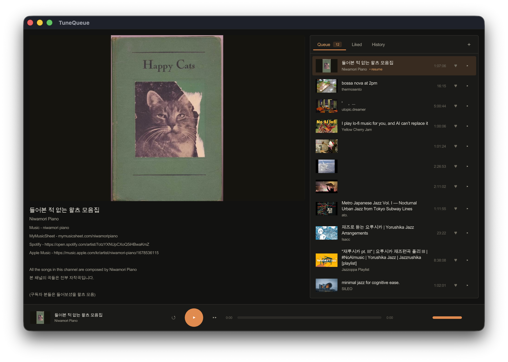

# TuneQueue

This is a vibe coded music/video queue for YouTube videos, for personal use.

Main reason is that YouTube has been recommending me good music videos that can be used for background music in working. I kept adding new tabs for it and I do not want browser to be all of it so I think maybe a desktop app might be a better idea.



## Build and run

```
brew install raylib mpv yt-dlp   # dependencies
./build.sh                       # build both binaries (downloads deps first time)
./build.sh run                   # build and launch the GUI
./build.sh run-cli               # build and launch the text CLI
./build.sh test                  # build and run the tests
```

Build produces a GUI application `build/tune_queue_gui` (Clay/raylib) and a cli one `build/tune_queue_cli` (text).
run `./build.sh run` to start the GUI or start `build/tune_queue_gui` directly.

## Overview

### Dependencies

- **Clay, cJSON, stb_image** (auto-fetched during building): UI layout; JSON parsing; thumbnail JPEG decode.
- **raylib** (via brew): window, OpenGL rendering, fonts, textures, input (GUI only).
- **libmpv** (via brew): audio playback; resolves streams via yt-dlp.
- **yt-dlp** (via brew): turns a YouTube URL into a stream URL (called by mpv).
- **sqlite3, libcurl** (should be pre-installed I assume)  :persistence; metadata and thumbnail HTTP.

### Layout

```
src/
  core/
    app.c/.h      core app config and the shared app_* command interface
  data/
    db.c/.h       persistent data base layer (queue, sessions, history, likes, stats, settings), wrappers to SQLite
    model.h       shared data structs
  media/
    player.c/.h   libmpv audio playback
    youtube.c/.h  URL parsing, ISO-8601 duration parsing, Data API + oEmbed metadata fetch
    thumbs.c/.h   threaded thumbnail download with an on-disk cache (GUI)
    frames.c/.h   periodic video still grabbed by a background mpv worker (GUI)
  helper/
    helper.c/.h   generic filesystem primitives (home join, mkdir -p, read file)
  gui/
    gui.c         Clay layout, raylib loop, input, dialogs; GUI entry point
  cli/
    cli.c         text REPL over the same core; CLI entry point
test/             mirrors src/, each test builds its own throwaway database
3rd/              downloaded on first build, untracked (clay, cjson, stb)
```

### Storage

- **Database:** `~/Library/Application Support/TuneQueue/data.db` (SQLite). Holds the queue, liked tracks, per-track listening sessions and watch-time history, and the YouTube Data API key. This is the durable state; deleting it resets the app. Override with `YTQ_DB_PATH`.
- **Thumbnail cache:** `~/Library/Caches/TuneQueue/thumbnails/`. One JPEG per video, downloaded on first sight and reused across launches. Pure cache: safe to delete, refills on demand.

### Typography

Font is `Arial Unicode.ttf` (macOS system fonts). CJK is supported; emoji is not.

